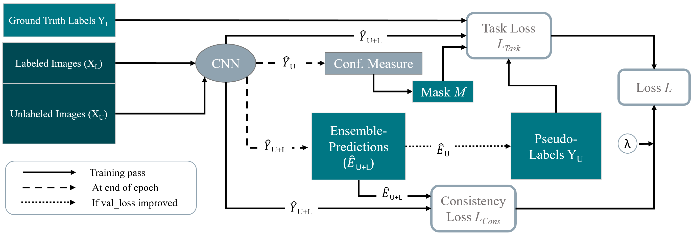

# Uncertainty-Aware Temporal Self-Learning (UATS)

This repository contains the source code of the paper *Uncertainty-Aware Temporal Self-Learning (UATS): Semi-SupervisedLearning for Segmentation of the Prostate and Beyond*, submitted in *Artificial Intelligence in Medicine Paper*.

## Highlights:
- A deep semi-supervised method named uncertainty-aware temporal self-learning (UATS) was proposed for segmentation.
- UATS leverages performance gains from temporal ensembling [(Laine and Aila)](https://arxiv.org/abs/1610.02242) and uncertainty-guided self-learning.
- UATS surpasses fully supervised performance on prostate zone segmentation and achieves human observer results quality.
- Further experiments demonstrate its generalizability on the following benchmark biomedical datasets:
  - [Prostate](http://www.var.ovgu.de/isbi2019/)
  - [ISIC2018 Skin Lesion Segmentation challenge](https://challenge2018.isic-archive.com/)
  - [Medical Decathlon Challenge Task 04 (Hippocampus Segmentation)](http://medicaldecathlon.com/)

## Training:
1. pip install -r requirements.txt
2. Experiment and dataset related changes to be made in the file: *utility/config.py*
3. The UATS model could be trained: python dataset_specific/prostate/expts/prostate_uats_softmax.py

